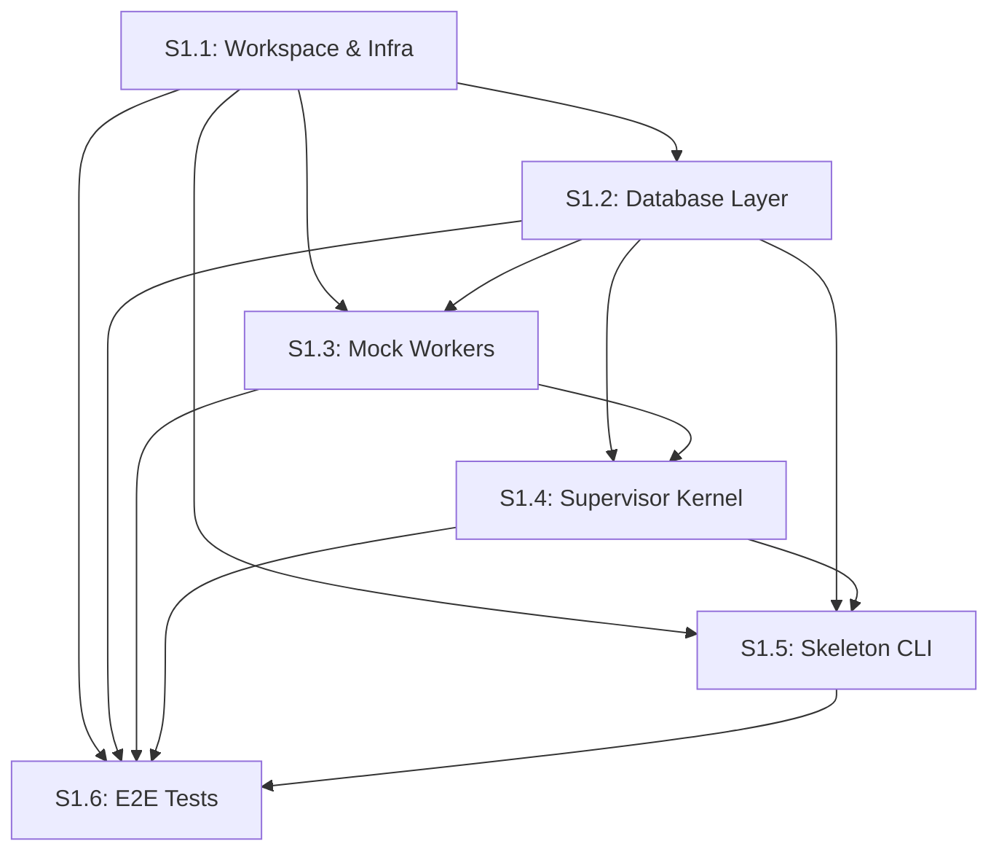

# GitHub Issues Export: Sprint 1 - The Skeleton Run

This document contains the complete set of GitHub Issues for Sprint 1, formatted for bulk import into GitHub Projects or Issues. Each issue includes all metadata required for project planning: labels, milestones, assignees, acceptance criteria, and cross-references.

---

## Issue Templates for GitHub Import

### Issue S1.1: Workspace & Infrastructure Initialization

```markdown
---
name: "S1.1: Workspace & Infrastructure Initialization"
about: "Establish the foundational monorepo structure, shared contracts, and local development infrastructure"
labels: ["sprint-1", "infrastructure", "contracts", "p0", "size-s"]
milestone: "Sprint 1: The Skeleton Run"
assignees: []
---

## Goal
Establish the foundational monorepo structure, shared contracts, and local development infrastructure (Postgres/Redis).

## Background
FYI Studio utilizes a Microkernel architecture. To ensure consistency across the Supervisor and various Workers, we require a central monorepo where `@fyi/contracts` serves as the source of truth.

## Scope
- [ ] Initialize an NPM/PNPM Workspace monorepo
- [ ] Implement the approved **Contracts v1.1** in TypeScript
- [ ] Configure Docker Compose for backing services (Postgres 15+, Redis 7+)
- **NOT in scope:** Production deployment configurations or CI/CD pipelines

## Deliverables
- [ ] `/package.json` (Root workspace config)
- [ ] `/docker-compose.yml` (Postgres 15+, Redis 7+)
- [ ] `/packages/contracts/package.json`
- [ ] `/packages/contracts/src/index.ts` (Approved v1.1 interfaces)
- [ ] `/packages/contracts/tsconfig.json`

## Dependencies
None.

## Acceptance Criteria
- [ ] `npm install` at root installs all dependencies
- [ ] `docker-compose up -d` starts Postgres and Redis without errors
- [ ] `npm run build -w @fyi/contracts` produces a valid `/dist` folder with type definitions

## Testing
- [ ] Verify `@fyi/contracts` exports all enums and interfaces via a simple test script
- [ ] Verify connectivity to Postgres and Redis using standard CLI tools (psql/redis-cli)

## Risks
- Version mismatch between Node.js environments

## Definition of Done
Infrastructure is up, and contracts are compiled and available for internal import.

## Estimated Effort
- **Complexity:** S (Small)
- **Hours:** 4 hours

## Related Documents
- [Sprint 1 Plan](../.ai/planning/sprints/Sprint-001/README.md)
- [Implementation Strategy](../.ai/planning/implementation-strategy.md)
- [Issue Detail](../.ai/planning/sprints/Sprint-001/Issue-001.md)
```

---

### Issue S1.2: Database Layer Implementation (The Ledger)

```markdown
---
name: "S1.2: Database Layer Implementation (The Ledger)"
about: "Implement the Job Ledger and Telemetry storage using Prisma ORM"
labels: ["sprint-1", "database", "prisma", "ledger", "p0", "size-s"]
milestone: "Sprint 1: The Skeleton Run"
assignees: []
---

## Goal
Implement the Job Ledger and Telemetry storage using Prisma ORM.

## Background
The Job Ledger is the system of record. Every state transition and worker output must be persisted here to satisfy the "Stateless Worker" requirement.

## Scope
- [ ] Setup `@fyi/database` package
- [ ] Define Prisma schema for `jobs` and `telemetry`
- [ ] Configure `JSONB` support for the `artifacts` and `recipe_snapshot` columns
- **NOT in scope:** Complex relational queries or database indexing for scale

## Deliverables
- [ ] `/packages/database/prisma/schema.prisma`
- [ ] `/packages/database/src/index.ts` (Exported Prisma Client)
- [ ] Migration files for initial table creation

## Dependencies
- S1.1 (Workspace & Infra Initialization)

## Acceptance Criteria
- [ ] Prisma Client is successfully generated
- [ ] A test script can create a `job` with a JSON `recipe_snapshot` and retrieve it
- [ ] Database schema follows `snake_case` naming conventions for columns as per Engineering Standards v1.0

## Testing
- [ ] Run `prisma migrate dev` to ensure schema validity
- [ ] CRUD test: Create a job, update its status to `RUNNING`, and verify the `updated_at` timestamp changes

## Risks
- Handling TypeScript types for JSONB fields in Prisma

## Definition of Done
Database schema is deployed to local Postgres and accessible via the internal package.

## Estimated Effort
- **Complexity:** S (Small)
- **Hours:** 4 hours

## Related Documents
- [Sprint 1 Plan](../.ai/planning/sprints/Sprint-001/README.md)
- [Implementation Strategy](../.ai/planning/implementation-strategy.md)
- [Issue S1.1](../.ai/planning/sprints/Sprint-001/Issue-001.md)
- [Issue Detail](../.ai/planning/sprints/Sprint-001/Issue-002.md)
```

---

### Issue S1.3: Mock Worker Suite

```markdown
---
name: "S1.3: Mock Worker Suite"
about: "Create three stateless mock workers (Research, Script, Voice) to prove the Worker-Supervisor communication loop"
labels: ["sprint-1", "workers", "mock-workers", "bullmq", "p0", "size-m"]
milestone: "Sprint 1: The Skeleton Run"
assignees: []
---

## Goal
Create three stateless mock workers (Research, Script, Voice) to prove the Worker-Supervisor communication loop.

## Background
Workers must implement the "Stateless Adapter" pattern. They listen for `TaskEnvelope` and return `WorkerResponse`.

## Scope
- [ ] Create three services in `/workers/`: `research`, `script`, `voice`
- [ ] Use **BullMQ** to listen to specific queues: `research-queue`, `script-queue`, `voice-queue`
- [ ] Simulate 2-second processing time
- [ ] Implement the standard logging of `job_id` and `execution_id`
- **NOT in scope:** Actual AI API integration

## Deliverables
- [ ] `/workers/research/src/index.ts`
- [ ] `/workers/script/src/index.ts`
- [ ] `/workers/voice/src/index.ts`
- [ ] Dockerfiles for each worker (optional for MVP, but recommended)

## Dependencies
- S1.1 (Workspace & Infra Initialization)
- S1.2 (Database Layer)

## Acceptance Criteria
- [ ] Workers correctly parse a `TaskEnvelope` v1.1
- [ ] Workers return a `WorkerResponse` v1.1 with valid `usage` and `performance` metrics
- [ ] Workers log their activity to the console in structured JSON format

## Testing
- [ ] Manually push a mock `TaskEnvelope` to Redis and verify the worker picks it up and returns a result to the completion queue

## Risks
- BullMQ connection timeouts in local Docker environments

## Definition of Done
All three mock workers are running and successfully responding to queue messages.

## Estimated Effort
- **Complexity:** M (Medium)
- **Hours:** 8 hours

## Related Documents
- [Sprint 1 Plan](../.ai/planning/sprints/Sprint-001/README.md)
- [Implementation Strategy](../.ai/planning/implementation-strategy.md)
- [Issue S1.2](../.ai/planning/sprints/Sprint-001/Issue-002.md)
- [Issue S1.4](../.ai/planning/sprints/Sprint-001/Issue-004.md)
- [Issue Detail](../.ai/planning/sprints/Sprint-001/Issue-003.md)
```

---

### Issue S1.4: Supervisor Kernel (The Core)

```markdown
---
name: "S1.4: Supervisor Kernel (The Core)"
about: "Implement the orchestration logic that manages the state machine and routes data between workers"
labels: ["sprint-1", "supervisor", "kernel", "orchestration", "state-machine", "p0", "size-l"]
milestone: "Sprint 1: The Skeleton Run"
assignees: []
---

## Goal
Implement the orchestration logic that manages the state machine and routes data between workers.

## Background
The Supervisor is the "CEO." It moves jobs through the DAG by reading the `ProductionRecipe` and dispatching tasks based on the completion of previous steps.

## Scope
- [ ] Create `/services/supervisor`
- [ ] Implement a "Step Resolver" that determines the next capability in the recipe
- [ ] Implement "Context Assembly" (merging `artifacts` into the next `TaskEnvelope`)
- [ ] Update the `jobs` table in Postgres after every worker completion
- **NOT in scope:** Error retry logic or Human-in-the-loop UI

## Deliverables
- [ ] `/services/supervisor/src/kernel.ts` (The main loop)
- [ ] `/services/supervisor/src/queue-handler.ts` (BullMQ listeners/producers)

## Dependencies
- S1.1 (Workspace & Infra Initialization)
- S1.2 (Database Layer)
- S1.3 (Mock Worker Suite)

## Acceptance Criteria
- [ ] Supervisor picks up a `PENDING` job and starts the first step
- [ ] Supervisor maps the `output` of Step N to the `payload` of Step N+1
- [ ] Supervisor marks job as `COMPLETED` only after the final worker in the recipe returns success

## Testing
- [ ] Unit test the "Step Resolver" logic with various mock recipes
- [ ] Integration test: Start the supervisor and mock workers, then verify the DB state transitions

## Risks
- Complexity in the mapping logic (mapping output keys to input keys)

## Definition of Done
The Supervisor can successfully move a job from the first step to the last without manual intervention.

## Estimated Effort
- **Complexity:** L (Large)
- **Hours:** 16 hours

## Related Documents
- [Sprint 1 Plan](../.ai/planning/sprints/Sprint-001/README.md)
- [Implementation Strategy](../.ai/planning/implementation-strategy.md)
- [Issue S1.3](../.ai/planning/sprints/Sprint-001/Issue-003.md)
- [Issue S1.5](../.ai/planning/sprints/Sprint-001/Issue-005.md)
- [Issue Detail](../.ai/planning/sprints/Sprint-001/Issue-004.md)
```

---

### Issue S1.5: Skeleton Run CLI

```markdown
---
name: "S1.5: Skeleton Run CLI"
about: "Create a simple command-line interface to trigger and monitor a Milestone 1 job"
labels: ["sprint-1", "cli", "trigger", "monitoring", "p1", "size-xs"]
milestone: "Sprint 1: The Skeleton Run"
assignees: []
---

## Goal
Create a simple command-line interface to trigger and monitor a Milestone 1 job.

## Background
We need a "Spark" to initiate the first production run and verify the OS is breathing.

## Scope
- [ ] A Node.js CLI script that seeds a `ProductionRecipe` and a `Job` into the DB
- [ ] Monitors the DB every 2 seconds and prints the status to the console
- **NOT in scope:** Any graphical user interface

## Deliverables
- [ ] `/packages/cli/src/trigger-run.ts`

## Dependencies
- S1.1 (Workspace & Infra Initialization)
- S1.2 (Database Layer)
- S1.4 (Supervisor Kernel)

## Acceptance Criteria
- [ ] Running `npm run start-skeleton` initiates a job
- [ ] The CLI outputs the status changes in real-time (e.g., "Researching...", "Scripting...")
- [ ] The CLI exits with a success message once the final artifact is in the DB

## Testing
- [ ] Verify that a job created via CLI appears correctly in the PostgreSQL `jobs` table

## Risks
- CLI exiting prematurely before the background worker finishes

## Definition of Done
A full skeleton run can be initiated and monitored from a single terminal command.

## Estimated Effort
- **Complexity:** XS (Extra Small)
- **Hours:** 2 hours

## Related Documents
- [Sprint 1 Plan](../.ai/planning/sprints/Sprint-001/README.md)
- [Implementation Strategy](../.ai/planning/implementation-strategy.md)
- [Issue S1.4](../.ai/planning/sprints/Sprint-001/Issue-004.md)
- [Issue S1.6](../.ai/planning/sprints/Sprint-001/Issue-006.md)
- [Issue Detail](../.ai/planning/sprints/Sprint-001/Issue-005.md)
```

---

### Issue S1.6: End-to-End Test Suite

```markdown
---
name: "S1.6: End-to-End Test Suite"
about: "Automate the verification of the entire 'Skeleton Run' to prevent future regressions"
labels: ["sprint-1", "e2e-testing", "integration-testing", "vitest", "regression", "p1", "size-s"]
milestone: "Sprint 1: The Skeleton Run"
assignees: []
---

## Goal
Automate the verification of the entire "Skeleton Run" to prevent future regressions.

## Background
As we move toward Milestone 2 (Real AI), we must ensure the core plumbing (Supervisor/Queue/Ledger) remains rock solid.

## Scope
- [ ] Implement a Vitest/Jest integration test
- [ ] The test must: Spin up infra, seed a job, wait for completion, and assert the contents of the `artifacts` column
- **NOT in scope:** Testing real AI responses

## Deliverables
- [ ] `/tests/e2e/skeleton-run.test.ts`

## Dependencies
- S1.1 through S1.5 (All previous issues must be complete)

## Acceptance Criteria
- [ ] Test passes consistently in the local development environment
- [ ] Assertions verify that `usage.cost_estimate` is correctly aggregated
- [ ] Assertions verify that `performance.duration_ms` is recorded for every step

## Testing
- [ ] Intentionally break a mock worker and verify the E2E test correctly identifies the failure

## Risks
- Flaky tests due to timing issues in the async queue

## Definition of Done
A single command `npm run test:e2e` validates the entire Milestone 1 architecture.

## Estimated Effort
- **Complexity:** S (Small)
- **Hours:** 4 hours

## Related Documents
- [Sprint 1 Plan](../.ai/planning/sprints/Sprint-001/README.md)
- [Implementation Strategy](../.ai/planning/implementation-strategy.md)
- [Issue S1.5](../.ai/planning/sprints/Sprint-001/Issue-005.md)
- [Issue Detail](../.ai/planning/sprints/Sprint-001/Issue-006.md)
```

---

## Bulk Import CSV Format

For GitHub Projects bulk import, use the following CSV format:

```csv
title,body,labels,milestone,assignees
"S1.1: Workspace & Infrastructure Initialization","[Full issue body from above]","sprint-1;infrastructure;contracts;p0;size-s","Sprint 1: The Skeleton Run",
"S1.2: Database Layer Implementation (The Ledger)","[Full issue body from above]","sprint-1;database;prisma;ledger;p0;size-s","Sprint 1: The Skeleton Run",
"S1.3: Mock Worker Suite","[Full issue body from above]","sprint-1;workers;mock-workers;bullmq;p0;size-m","Sprint 1: The Skeleton Run",
"S1.4: Supervisor Kernel (The Core)","[Full issue body from above]","sprint-1;supervisor;kernel;orchestration;state-machine;p0;size-l","Sprint 1: The Skeleton Run",
"S1.5: Skeleton Run CLI","[Full issue body from above]","sprint-1;cli;trigger;monitoring;p1;size-xs","Sprint 1: The Skeleton Run",
"S1.6: End-to-End Test Suite","[Full issue body from above]","sprint-1;e2e-testing;integration-testing;vitest;regression;p1;size-s","Sprint 1: The Skeleton Run",
```

---

## Summary Statistics

| Metric | Value |
|--------|-------|
| **Total Issues** | 6 |
| **Total Estimated Hours** | 38 hours |
| **P0 (Critical) Issues** | 4 (S1.1, S1.2, S1.3, S1.4) |
| **P1 (High) Issues** | 2 (S1.5, S1.6) |
| **Size Distribution** | XS: 1, S: 3, M: 1, L: 1 |

---

## Dependency Graph



---

## Critical Path

The critical path for Sprint 1 execution is:

1. **S1.1** (4h) → **S1.2** (4h) → **S1.3** (8h) → **S1.4** (16h) → **S1.5** (2h) → **S1.6** (4h)
2. **Total Critical Path Duration:** ~38 hours (sequential)
3. **Parallelizable:** None - strict sequential dependencies

---

## Cross-References

- **Implementation Strategy:** [../implementation-strategy.md](../implementation-strategy.md)
- **Sprint Plan:** [./sprints/Sprint-001/README.md](./sprints/Sprint-001/README.md)
- **Individual Issues:** [./sprints/Sprint-001/Issue-001.md](./sprints/Sprint-001/Issue-001.md) through [Issue-006.md](./sprints/Sprint-001/Issue-006.md)
- **Architecture:** [Architecture Decision Records](../../architecture/)
- **Contracts:** [Contracts v1.1](../../contracts/contracts-v1.1.md)
- **Engineering Standards:** [Engineering Standards v1.0](../../standards/engineering-standards-v1.0.md)